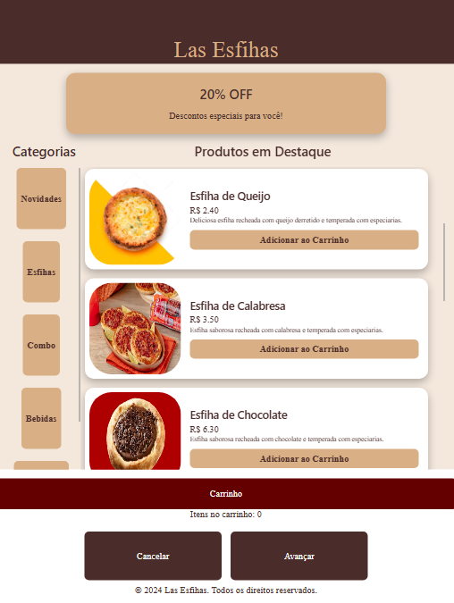

# 🛒 Ecommerce Totem

🔗 Acesse o projeto (recomendado usar a escala de IPad 1024 x1366):

👉 https://monteiromagmoss.github.io/EcommerceTotem/

### Informações para login:
  Usuários:
  - cliente@cliente.com (Senha: 123)
  - admin@admin.com (Senha: 123)

## 📌 Sobre o projeto

O Ecommerce Totem é uma aplicação web desenvolvida com foco em simular um sistema de autoatendimento digital para compras, inspirado em totens interativos utilizados em lojas físicas.

O projeto foi desenvolvido com o objetivo de praticar e consolidar conhecimentos em Front-End, com foco em interatividade, usabilidade e organização de componentes.

### 🚀 Tecnologias utilizadas
- ⚛️ React
- 🟨 JavaScript
- 🌐 HTML5
- 🎨 CSS3
- ⚡ Vite
### 🎯 Funcionalidades
- 📦 Visualização de produtos
- 🛒 Sistema de seleção/compra
- 👤 Simulação de fluxo de usuário
- 📊 Interface administrativa (em desenvolvimento ou simulada)
- ⏱️ Atualização dinâmica de dados (ex: horário, estados, etc.)
- 💡 Objetivo do projeto

### Este projeto foi criado com foco em:

- Praticar React na construção de interfaces dinâmicas
- Simular um ambiente real de e-commerce / autoatendimento
- Melhorar habilidades em organização de código e componentes
- Criar um projeto sólido para portfólio profissional

## 📸 Preview

  

